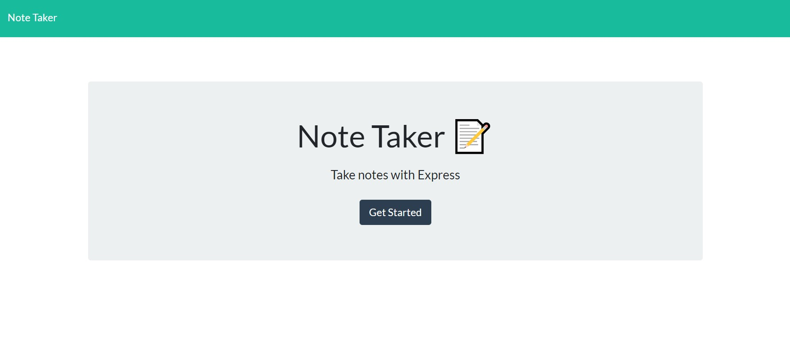
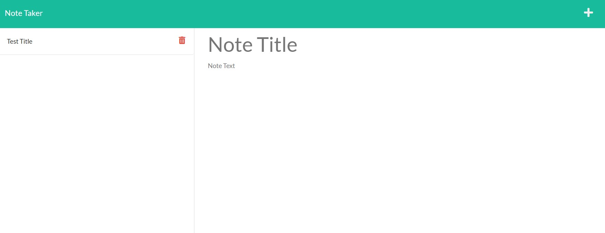

# note-taker

## Description 
This is a Node.js application called Note Taker that can be used to write, save, and delete notes.

Link to deployed app:
🔗https://dry-basin-28521.herokuapp.com/

## Screenshots

## Table of Contents
* [License](#license)
* [Questions](#questions)

## License
🔗https://opensource.org/licenses/MIT

## Questions
Please reach out via email or GitHub with questions or issues.

🔗https://github.com/alexchristianson

📧alex.christianson.05@gmail.com
